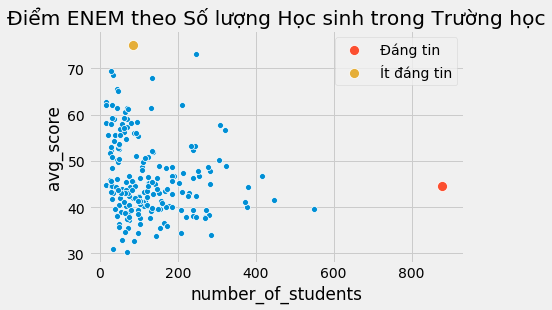
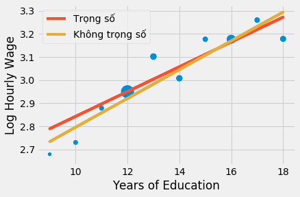
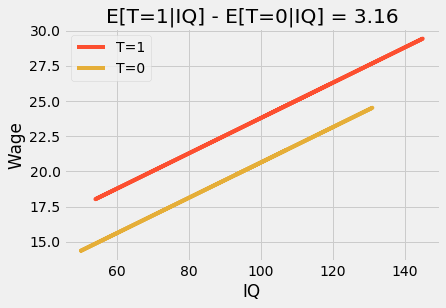

<h1>Table of Contents<span class="tocSkip"></span></h1>
<div class="toc"><ul class="toc-item"><li><span><a href="#@@Regression@@-với-@@Grouped-Data@@" data-toc-modified-id="@@Regression@@-với-@@Grouped-Data@@-1"><span class="toc-item-num">1&nbsp;&nbsp;</span>@@Regression@@ với @@Grouped Data@@</a></span></li><li><span><a href="#@@Regression@@--với-các-@@Dummy@@" data-toc-modified-id="@@Regression@@--với-các-@@Dummy@@-2"><span class="toc-item-num">2&nbsp;&nbsp;</span>@@Regression@@  với các @@Dummy@@</a></span></li><li><span><a href="#Ý-tưởng-chủ-đạo" data-toc-modified-id="Ý-tưởng-chủ-đạo-3"><span class="toc-item-num">3&nbsp;&nbsp;</span>Ý tưởng chủ đạo</a></span></li><li><span><a href="#Tài-liệu-tham-khảo" data-toc-modified-id="Tài-liệu-tham-khảo-4"><span class="toc-item-num">4&nbsp;&nbsp;</span>Tài liệu tham khảo</a></span></li></ul></div>

## @@Regression@@ với @@Grouped Data@@
Không phải tất cả điểm dữ liệu đều bình đẳng. Nếu chúng ta lật lại bộ dữ liệu ENEM, chúng ta tin tưởng điểm số của các trường lớn hơn các trường nhỏ. Điều này không hàm ý các trường lớn tốt hơn mà chỉ đề cập thực tế rằng cỡ mẫu lớn có phương sai nhỏ hơn.
## Regression With Grouped Data

Not all data points are created equal. If we look again at our ENEM dataset, we trust much more in the score of big schools than in the ones from small schools. This is not to say that big schools are better or anything. It is just due to the fact that their big size imply less variance.

```python
import warnings
warnings.filterwarnings('ignore')

import pandas as pd
import numpy as np
from scipy import stats
from matplotlib import style
import seaborn as sns
from matplotlib import pyplot as plt
import statsmodels.formula.api as smf

style.use("fivethirtyeight")
```
import warnings
warnings.filterwarnings('ignore')

import pandas as pd
import numpy as np
from scipy import stats
from matplotlib import style
import seaborn as sns
from matplotlib import pyplot as plt
import statsmodels.formula.api as smf

style.use("fivethirtyeight")

```python
np.random.seed(876)
enem = pd.read_csv("./data/enem_scores.csv").sample(200)
# plt.figure(figsize=(8,4))
sns.scatterplot(y="avg_score", x="number_of_students", data=enem)
sns.scatterplot(y="avg_score", x="number_of_students", s=100, label="Đáng tin",
                data=enem.query(f"number_of_students=={enem.number_of_students.max()}"))
sns.scatterplot(y="avg_score", x="number_of_students", s=100, label="Ít đáng tin",
                data=enem.query(f"avg_score=={enem.avg_score.max()}"))
plt.title("Điểm ENEM theo Số lượng Học sinh trong Trường học");
```




np.random.seed(876)
enem = pd.read_csv("./data/enem_scores.csv").sample(200)
# plt.figure(figsize=(8,4))
sns.scatterplot(y="avg_score", x="number_of_students", data=enem)
sns.scatterplot(y="avg_score", x="number_of_students", s=100, label="Trustworthy",
                data=enem.query(f"number_of_students=={enem.number_of_students.max()}"))
sns.scatterplot(y="avg_score", x="number_of_students", s=100, label="Not so Much",
                data=enem.query(f"avg_score=={enem.avg_score.max()}"))
plt.title("ENEM Score by Number of Students in the School");
Trong dữ liệu trên đây, trực giác mách bảo rằng các điểm phía bên trái chi phối mô hình ít hơn so với các điểm bên phải. Lý do là các điểm bên phải cộng gộp nhiều điểm dữ liệu đơn lẻ hơn. Nếu chúng ta có thể phân tách chúng và chạy một @@linear regression@@ dựa vào @@ungrouped data@@, thì chúng sẽ đóng góp nhiều hơn vào việc ước lượng mô hình so với các điểm bên trái.

Hiện tượng tồn tại những vùng dữ liệu với @@variance@@ thấp bên cạnh những vùng dữ liệu với @@variance@@ cao được gọi là **@@heteroskedasticity@@**. Giải thích một cách đơn giản, @@heteroskedasticity@@ xảy ra nếu @@variance@@ không cố định khi thay đổi giá trị của @@feature@@. Trong ví dụ trên, chúng ta có thể thấy  @@variance@@ giảm khi  @@feature@@ @@sample size@@ tăng. Một ví dụ khác cho @@heteroskedasticity@@, nếu bạn vẽ đồ thị tiền lương theo tuổi tác, bạn sẽ thấy @@variance@@ của mức lương sẽ cao hơn ở người nhiều tuổi so với người ít tuổi. Nhưng có lẽ lý do phổ biến nhất cho sự thay đổi @@variance@@ là @@grouped data@@.

@@Grouped data@@ giống như trường hợp trên đây vô cùng phổ biến trong @@data analysis@@. Một lý do thường gặp là bảo mật thông tin. Các chính phủ và công ty không được phép cung cấp thông tin cá nhân vì điều này có thể vi phạm các quy định về quyền riêng tư mà họ phải tuân thủ. Vì thế, nếu họ cần cung cấp dữ liệu cho các nhà nghiên cứu bên ngoài, họ chỉ có thể @@group data@@. Bằng cách này, các cá nhân được nhóm lại với nhau và vì thế không lo bị lộ danh tính.

May mắn là @@regression@@ có thể xử lý khá tốt loại dữ liệu này. Để hiểu về nó, hãy nhìn vào một số @@ungrouped data@@ như chúng ta có về tiền lương và giáo dục. Mỗi hàng dữ liệu cung cấp thông tin về một người lao động và cho ta biết số tiền lương cũng như số năm học vấn của người đó.
In the data above, intuitively, points to the left should have less impact in my model than points to the right. In essence, points to the right are actually lots of other data points grouped into a single one. If we could unbundle them and run a linear regression on the ungrouped data, they would indeed contribute much more to the model estimation than an unbundled point in the left. 

This phenomenon of having a region of low variance and another of high variance is called **heteroskedasticity**. Put it simply, heteroskedasticity is when the variance is not constant across values of the features. In the case above, we can see that the variance decreases as the feature sample size increases. To give an example of where we have heteroskedasticity, if you plot wage by age, you will see that there is higher wage variance for the old than for the young. But by far, the most common reason for variance to differ is grouped data.

Grouped data like the one above are extremely common in data analysis. One reason for that is confidentiality. Governments and firms can't give away personal data because that would violate data privacy requirements they have to follow. So, if they need to export data to an outside researcher, they can only do it by means of grouping the data. This way, individuals get grouped together and are no longer uniquely identifiable.

Fortunately, regression can handle those kinds of data pretty well. To understand how, let's first take some ungrouped data like the one we had on wage and education. It contains one line per worker, so we know the wage for each individual in this dataset and also how many years of education he or she has.

```python
wage = pd.read_csv("./data/wage.csv").dropna()[["wage", "lhwage", "educ", "IQ"]]
wage.head()
```


<div>
<style scoped>
    .dataframe tbody tr th:only-of-type {
        vertical-align: middle;
    }

    .dataframe tbody tr th {
        vertical-align: top;
    }

    .dataframe thead th {
        text-align: right;
    }
</style>
<table border="1" class="dataframe">
  <thead>
    <tr style="text-align: right;">
      <th></th>
      <th>wage</th>
      <th>lhwage</th>
      <th>educ</th>
      <th>IQ</th>
    </tr>
  </thead>
  <tbody>
    <tr>
      <th>0</th>
      <td>769</td>
      <td>2.956212</td>
      <td>12</td>
      <td>93</td>
    </tr>
    <tr>
      <th>2</th>
      <td>825</td>
      <td>3.026504</td>
      <td>14</td>
      <td>108</td>
    </tr>
    <tr>
      <th>3</th>
      <td>650</td>
      <td>2.788093</td>
      <td>12</td>
      <td>96</td>
    </tr>
    <tr>
      <th>4</th>
      <td>562</td>
      <td>2.642622</td>
      <td>11</td>
      <td>74</td>
    </tr>
    <tr>
      <th>6</th>
      <td>600</td>
      <td>2.708050</td>
      <td>10</td>
      <td>91</td>
    </tr>
  </tbody>
</table>
</div>


wage = pd.read_csv("./data/wage.csv").dropna()[["wage", "lhwage", "educ", "IQ"]]
wage.head()
Nếu chúng ta chạy @@regression model@@ để tìm hiểu giáo dục tương quan như thế nào với log của tiền lương theo giờ, chúng ta thu được kết quả sau:
If we run a regression model to figure out how education is associated with log hourly wages, we get the following result.

```python
model_1 = smf.ols('lhwage ~ educ', data=wage).fit()
model_1.summary().tables[1]
```


<table class="simpletable">
<tr>
      <td></td>         <th>coef</th>     <th>std err</th>      <th>t</th>      <th>P>|t|</th>  <th>[0.025</th>    <th>0.975]</th>  
</tr>
<tr>
  <th>Intercept</th> <td>    2.3071</td> <td>    0.104</td> <td>   22.089</td> <td> 0.000</td> <td>    2.102</td> <td>    2.512</td>
</tr>
<tr>
  <th>educ</th>      <td>    0.0536</td> <td>    0.008</td> <td>    7.114</td> <td> 0.000</td> <td>    0.039</td> <td>    0.068</td>
</tr>
</table>


model_1 = smf.ols('lhwage ~ educ', data=wage).fit()
model_1.summary().tables[1]
Tuy nhiên, hãy vờ như dữ liệu trên đây bị hạn chế do bảo mật thông tin. Nhà cung cấp không được phép tiết lộ thông tin cá nhân. Vì thế, chúng ta đề nghị họ nhóm gộp các cá nhân theo số năm học vấn và cung cấp cho chúng ta mức bình quân của log tiền lương theo giờ và số cá nhân trong mỗi nhóm. Việc này giúp chúng ta thu được 10 điểm dữ liệu.
However, let's pretend for a moment that this data was under some confidentiality constraint. The provider of it was not able to give individualised data. So we ask him instead to group everyone by years of education and give us only the mean log hourly wage and the number of individuals in each group. This leaves us with only 10 data points.

```python
group_wage = (wage
              .assign(count=1)
              .groupby("educ")
              .agg({"lhwage":"mean", "count":"count"})
              .reset_index())

group_wage
```


<div>
<style scoped>
    .dataframe tbody tr th:only-of-type {
        vertical-align: middle;
    }

    .dataframe tbody tr th {
        vertical-align: top;
    }

    .dataframe thead th {
        text-align: right;
    }
</style>
<table border="1" class="dataframe">
  <thead>
    <tr style="text-align: right;">
      <th></th>
      <th>educ</th>
      <th>lhwage</th>
      <th>count</th>
    </tr>
  </thead>
  <tbody>
    <tr>
      <th>0</th>
      <td>9</td>
      <td>2.679533</td>
      <td>4</td>
    </tr>
    <tr>
      <th>1</th>
      <td>10</td>
      <td>2.730512</td>
      <td>21</td>
    </tr>
    <tr>
      <th>2</th>
      <td>11</td>
      <td>2.878807</td>
      <td>25</td>
    </tr>
    <tr>
      <th>3</th>
      <td>12</td>
      <td>2.949520</td>
      <td>270</td>
    </tr>
    <tr>
      <th>4</th>
      <td>13</td>
      <td>3.101693</td>
      <td>56</td>
    </tr>
    <tr>
      <th>5</th>
      <td>14</td>
      <td>3.007821</td>
      <td>53</td>
    </tr>
    <tr>
      <th>6</th>
      <td>15</td>
      <td>3.176634</td>
      <td>32</td>
    </tr>
    <tr>
      <th>7</th>
      <td>16</td>
      <td>3.176659</td>
      <td>121</td>
    </tr>
    <tr>
      <th>8</th>
      <td>17</td>
      <td>3.259375</td>
      <td>35</td>
    </tr>
    <tr>
      <th>9</th>
      <td>18</td>
      <td>3.178160</td>
      <td>46</td>
    </tr>
  </tbody>
</table>
</div>


group_wage = (wage
              .assign(count=1)
              .groupby("educ")
              .agg({"lhwage":"mean", "count":"count"})
              .reset_index())

group_wage
Đừng lo lắng! @@Regression@@ không cần @@big data@@ để hoạt động! Điều chúng ta cần làm là cung cấp các @@weight@@ cho @@linear regression model@@. Bằng cách này, nó sẽ xem trọng các nhóm với @@sample size@@ lớn hơn các nhóm nhỏ. Lưu ý việc tôi thay thế `smf.ols` bằng `smf.wls` để thực hiện @@weighted least squares@@. Có vẻ hơi khó nhận biết nhưng nó thực sự tạo ra khác biệt lớn.
But fear not! Regression doesn't need big data to work! What we can do is provide weights to our linear regression model. This way, it will consider groups with higher sample size more than the small groups. Notice how I've replaced the `smf.ols` with `smf.wls`, for weighted least squares. It's hard to notice, but it will make all the difference.

```python
model_2 = smf.wls('lhwage ~ educ', data=group_wage, weights=group_wage["count"]).fit()
model_2.summary().tables[1]
```


<table class="simpletable">
<tr>
      <td></td>         <th>coef</th>     <th>std err</th>      <th>t</th>      <th>P>|t|</th>  <th>[0.025</th>    <th>0.975]</th>  
</tr>
<tr>
  <th>Intercept</th> <td>    2.3071</td> <td>    0.108</td> <td>   21.321</td> <td> 0.000</td> <td>    2.058</td> <td>    2.557</td>
</tr>
<tr>
  <th>educ</th>      <td>    0.0536</td> <td>    0.008</td> <td>    6.867</td> <td> 0.000</td> <td>    0.036</td> <td>    0.072</td>
</tr>
</table>


model_2 = smf.wls('lhwage ~ educ', data=group_wage, weights=group_wage["count"]).fit()
model_2.summary().tables[1]
Lưu ý @@parameter estimate@@  `educ` trong @@grouped model@@ chính bằng mô hình với @@ungrouped data@@. Hơn nữa, chỉ với 10 @@data point@@, chúng ta đã thu về một @@statistically significant coefficient@@! Đó là bởi vì mặc dù chúng ta có ít điểm dữ liệu hơn, việc nhóm gộp cũng làm giảm @@variance@@ khá nhiều. Cũng cần lưu ý việc @@standard error@@ trở nên lơn hơn và tương tự với @@t statistics@@. Đó là hậu quả của việc mất bớt thông tin về @@variance@@, và vì thế chúng ta cần thận trọng hơn. Khi chúng ta @@group data@@, chúng ta không biết @@variance@@ trong mỗi nhóm. Hãy so sánh kết quả trên với mô hình không có trọng số dưới đây.
Notice how the parameter estimate of educ in the grouped model is exactly the same as the one in the ungrouped data. Also, even with only 10 data points, we've managed to get a statistically significant coefficient. That's because, although we have fear points, grouping also lowers the variance by a lot. Also notice how the standard error is a bit larger, as is the t statistics. That's because some information about the variance is lost, so we have to be more conservative. Once we group the data, we don't know how large the variance is within each group. Compare the results above with what we would have with the non weighted model below.

```python
model_3 = smf.ols('lhwage ~ educ', data=group_wage).fit()
model_3.summary().tables[1]
```


<table class="simpletable">
<tr>
      <td></td>         <th>coef</th>     <th>std err</th>      <th>t</th>      <th>P>|t|</th>  <th>[0.025</th>    <th>0.975]</th>  
</tr>
<tr>
  <th>Intercept</th> <td>    2.1739</td> <td>    0.111</td> <td>   19.497</td> <td> 0.000</td> <td>    1.917</td> <td>    2.431</td>
</tr>
<tr>
  <th>educ</th>      <td>    0.0622</td> <td>    0.008</td> <td>    7.702</td> <td> 0.000</td> <td>    0.044</td> <td>    0.081</td>
</tr>
</table>


model_3 = smf.ols('lhwage ~ educ', data=group_wage).fit()
model_3.summary().tables[1]
@@Parameter estimate@@ trở nên lớn hơn. Điều xảy ra ở đây là mô hình @@regression@@ đặt trọng số như nhau cho tất cả các điểm. Nếu chúng ta vẽ đồ thị các mô hình theo các điểm nhóm gộp, chúng ta thấy mô hình không trọng số quá xem trọng các điểm nhỏ góc bên trái phía dưới hơn. Hậu quả là đường hồi quy dốc hơn.
The parameter estimate is larger. What is happening here is that the regression is placing equal weight for all points. If we plot the model along the grouped points, we see that the non weighted model is given more importance to  small points in the lower right than it should. As a consequence, the line has a higher slope.

```python
sns.scatterplot(x="educ", y = "lhwage", size="count", legend=False, data=group_wage, sizes=(40, 400))
plt.plot(wage["educ"], model_2.predict(wage["educ"]), c="C1", label = "Trọng số")
plt.plot(wage["educ"], model_3.predict(wage["educ"]), c="C2", label = "Không trọng số")
plt.xlabel("Years of Education")
plt.ylabel("Log Hourly Wage")
plt.legend();
```




sns.scatterplot(x="educ", y = "lhwage", size="count", legend=False, data=group_wage, sizes=(40, 400))
plt.plot(wage["educ"], model_2.predict(wage["educ"]), c="C1", label = "Weighted")
plt.plot(wage["educ"], model_3.predict(wage["educ"]), c="C2", label = "Non Weighted")
plt.xlabel("Years of Education")
plt.ylabel("Log Hourly Wage")
plt.legend();
Điểm mấu chốt là @@regression@@ là một công cụ kì diệu, có thể được sử dụng với cả dữ liệu cá nhân và dữ liệu nhóm gộp, tuy nhiên bạn phải sử dụng các @@weight@@ như trường hợp trên đây. Để sử dụng @@weighted regression@@, bạn cần các giá trị thống kê trung bình. Không phải @@sum@@, @@standard deviation@@ mà phải là giá trị trung bình của cả các  @@covariate@@ và @@dependent variable@@. Với trường hợp hồi quy hai biến, kết quả của  @@weighted regression@@ sử dụng @@grouped data@@ không hoàn toàn giống hệt @@regression@@ với @@ungrouped data@@ nhưng khá tương tự. 


Tôi sẽ dừng lại với một ví dụ sử dụng nhiều @@covariate@@ trong mô hình @@grouped data@@.
The bottom line is that regression is this marvellous tool that works both with individual or aggregated data, but you have to use weights in this last case. To use weighted regression you need mean statistics. Not sum, not standard deviation, but means! For both the covariates and the dependent variable. With the exception of the bivariate case, the result of weighted regression with grouped data won't match exactly that of regression in ungrouped data, but it will be pretty similar. 


I'll finish with a final example using additional covariates in a grouped data model.

```python
group_wage = (wage
              .assign(count=1)
              .groupby("educ")
              .agg({"lhwage":"mean", "IQ":"mean", "count":"count"})
              .reset_index())

model_4 = smf.ols('lhwage ~ educ + IQ', data=group_wage).fit()
print("Number of observations:", model_4.nobs)
model_4.summary().tables[1]
```

    Number of observations: 10.0
    


<table class="simpletable">
<tr>
      <td></td>         <th>coef</th>     <th>std err</th>      <th>t</th>      <th>P>|t|</th>  <th>[0.025</th>    <th>0.975]</th>  
</tr>
<tr>
  <th>Intercept</th> <td>    1.9747</td> <td>    0.427</td> <td>    4.629</td> <td> 0.002</td> <td>    0.966</td> <td>    2.983</td>
</tr>
<tr>
  <th>educ</th>      <td>    0.0464</td> <td>    0.034</td> <td>    1.377</td> <td> 0.211</td> <td>   -0.033</td> <td>    0.126</td>
</tr>
<tr>
  <th>IQ</th>        <td>    0.0041</td> <td>    0.008</td> <td>    0.486</td> <td> 0.642</td> <td>   -0.016</td> <td>    0.024</td>
</tr>
</table>


group_wage = (wage
              .assign(count=1)
              .groupby("educ")
              .agg({"lhwage":"mean", "IQ":"mean", "count":"count"})
              .reset_index())

model_4 = smf.ols('lhwage ~ educ + IQ', data=group_wage).fit()
print("Number of observations:", model_4.nobs)
model_4.summary().tables[1]
## @@Regression@@  với các @@Dummy@@

@@Dummy variable@@ là các @@categorical variable@@ mà chúng ta mã hóa dưới dạng cột nhị phân. Ví dụ, giả sử bạn có biến giới tính và muốn sử dụng nó trong mô hình. @@Variable@@ này được mã hóa theo 3 @@category@@: nam, nữ và giới tính khác. 

|giới tính|
|------|
|  |
|nữ|
|nữ|
|khác |
|nam  |

Vì mô hình của chúng ta chỉ chấp nhận các giá trị bằng số, chúng ta cần chuyển đổi các @@category@@ này thành số. Trong @@linear regression@@, chúng ta sử dụng các @@dummy@@ cho mục đích này. Chúng ta mã hóa mỗi @@variable@@ dưới dạng các cột 0/1, tùy theo @@category@@ có hiện diện hay không. Chúng ta không mã hóa một trong số các  @@category@@ mà sử dụng nó làm @@base category@@. Điều này là cần thiết vì @@category@@ này là @@linear combination@@ của các @@category@@ khác. Nói cách khác, chúng ta tính giá trị của @@category@@ này nếu ai đó cho chúng ta biết thông tin về tất cả các @@category@@ khác. Trong ví dụ của chúng ta, nếu ai đó không phải nữ và không thuộc giới tính khác thì hẳn người đó phải là nam.

|giới tính|nữ|khác|
|------|:-----|:----|
|nam  |0|0|
|nữ|1|0|
|nữ|1|0|
|khác |0|1|
|nam  |0|0|


Chúng ta đã giải quyết dạng một dạng đơn giản của @@dummy regression@@ khi thực hiện @@a/b test@@. Khái quát hơn, khi chúng ta đối mặt với một @@binary treatment@@, chúng ta biểu diễn nó dưới dạng một @@dummy variable@@. Trong trường  hợp này **@@regression coefficient@@ của @@dummy@@ là sự dịch chuyển @@intercept@@ của @@regression line@@**, hoặc hiệu của giá trị trung bình giữa nhóm @@treated@@ và @@untreated@@.

Để hiểu rõ điều này hơn, hãy xem xét bài toán @@estimate@@ tác động của việc học hết lớp 12 đối với  tiền lương theo giờ (để đơn giản hóa chúng ta không cân nhắc các @@confounder@@ trong ví dụ này). Ở dòng @@code@@ dưới đây, chúng ta khởi tạo một @@treatment dummy variable@@ `T` để chỉ số năm học vấn lớn hơn hoặc bằng 12. 
## Regression for Dummies

Dummy variables are categorical variables we've encoded as binary columns. For example, suppose you have a gender variable that you wish to include in your model. This variable is encoded into 3 categories: male, female and other genders. 

|gender|
|------|
|male  |
|female|
|female|
|other |
|male  |

Since our model only accepts numerical values, we need to convert this category to a number. In linear regression, we use dummies for that. We encode each variable as a 0/1 column, denoting if that category is present or not. We also leave one of the categories out as the base category. This is necessary since the last category is a linear combination of the others. Put it differently, we can know the last category if someone gives us information on the others. In our example, if someone is neither female nor other genders, we can infer that the person's category is male.

|gender|female|other|
|------|:-----|:----|
|male  |0|0|
|female|1|0|
|female|1|0|
|other |0|1|
|male  |0|0|


We've already dealt with a simple form of dummy regression when dealing with A/B testing. More generally, when we are dealing with a binary treatment, we represent it as a dummy variable. In this case, **the regression coefficient for that dummy is the increment for the intercept in the regression line**, or the difference in means between the treated and untreated.

To make this more concrete, consider the problem of estimating the effect of graduating 12th grade on hourly wage (and lest ignore confounding just for now). In the code below, we've created a treatment dummy variable `T` indicating if years of education is greater than 12. 

```python
wage = (pd.read_csv("./data/wage.csv")
        .assign(hwage=lambda d: d["wage"] / d["hours"])
        .assign(T=lambda d: (d["educ"] > 12).astype(int)))

wage[["hwage", "IQ", "T"]].head()
```


<div>
<style scoped>
    .dataframe tbody tr th:only-of-type {
        vertical-align: middle;
    }

    .dataframe tbody tr th {
        vertical-align: top;
    }

    .dataframe thead th {
        text-align: right;
    }
</style>
<table border="1" class="dataframe">
  <thead>
    <tr style="text-align: right;">
      <th></th>
      <th>hwage</th>
      <th>IQ</th>
      <th>T</th>
    </tr>
  </thead>
  <tbody>
    <tr>
      <th>0</th>
      <td>19.225</td>
      <td>93</td>
      <td>0</td>
    </tr>
    <tr>
      <th>1</th>
      <td>16.160</td>
      <td>119</td>
      <td>1</td>
    </tr>
    <tr>
      <th>2</th>
      <td>20.625</td>
      <td>108</td>
      <td>1</td>
    </tr>
    <tr>
      <th>3</th>
      <td>16.250</td>
      <td>96</td>
      <td>0</td>
    </tr>
    <tr>
      <th>4</th>
      <td>14.050</td>
      <td>74</td>
      <td>0</td>
    </tr>
  </tbody>
</table>
</div>


wage = (pd.read_csv("./data/wage.csv")
        .assign(hwage=lambda d: d["wage"] / d["hours"])
        .assign(T=lambda d: (d["educ"] > 12).astype(int)))

wage[["hwage", "IQ", "T"]].head()
@@Dummy@@ hoạt động như một loại công tắc. Trong ví dụ của chúng ta, nếu @@dummy@@ được bật, @@predicted value@@ bằng @@intercept@@ cộng với @@dummy coefficient@@. Nếu @@dummy@@ tắt, @@predicted value@@ chỉ bằng @@intercept@@. 
The dummy works as a kind of switch. In our example, if the dummy is on, the predicted value is the intercept plus the dummy coefficient. If the dummy is off, the predicted value is just the intercept. 

```python
smf.ols('hwage ~ T', data=wage).fit().summary().tables[1]
```


<table class="simpletable">
<tr>
      <td></td>         <th>coef</th>     <th>std err</th>      <th>t</th>      <th>P>|t|</th>  <th>[0.025</th>    <th>0.975]</th>  
</tr>
<tr>
  <th>Intercept</th> <td>   19.9405</td> <td>    0.436</td> <td>   45.685</td> <td> 0.000</td> <td>   19.084</td> <td>   20.797</td>
</tr>
<tr>
  <th>T</th>         <td>    4.9044</td> <td>    0.626</td> <td>    7.830</td> <td> 0.000</td> <td>    3.675</td> <td>    6.134</td>
</tr>
</table>


smf.ols('hwage ~ T', data=wage).fit().summary().tables[1]
Trong trường hợp này, khi một người chưa học xong lớp 12 (@@dummy@@ tắt), thu nhập bình quân là 19.9. Khi anh ta hoặc cô ta học xong (@@dummy@@ bật), @@predicted value@@ hoặc thu nhập bình quân là 24.8449 (19.9405 + 4.9044). Vì vậy, @@dummy coefficient@@ phản ánh sự khác biệt của các giá trị trung bình, trong trường hợp này là 4.9044.

Nói cách khác, khi @@dependent variable@@ là biến @@binary@@, một hiện tượng khá phổ biến với @@treatment indicator@@, @@regression@@ phản ảnh chính xác @@ATE@@. Trong trường hợp cụ thể này @@CEF@@ tuyến tính. Chúng ta có thể định nghĩa \\(E[Y_i|T_i=0]=\alpha\\) và \\(E[Y_i|T_i=1] = \alpha + \beta\\), rồi thu được @@CEF@@ sau:

$
E[Y_i|T_i] =  E[Y_i|T_i=0] + \beta T_i = \alpha + \beta T_i
$

và \\(\beta\\) là hiệu của các giá trị trung bình hoặc @@ATE@@ trong trường hợp dữ liệu ngẫu nhiên

$
\beta = [Y_i|T_i=1] - [Y_i|T_i=0]
$

Nếu chúng ta sử dụng thêm các biến khác, @@dummy coefficient@@ trở thành @@conditional difference in means@@. Ví dụ, nếu chúng ta bổ sung biến IQ vào mô hình trên. Bây giờ, @@dummy coefficient@@ cho chúng ta biết chúng ta nên kì vọng tiền lương tăng thêm bao nhiêu sau khi tốt nghiệp lớp 12 **khi cố định IQ**. Nếu chúng ta vẽ biểu đồ @@prediction@@, chúng ta sẽ thấy hai đường thẳng song song. Khoảng cách giữa hai đường cho biết số tiền chúng ta nên kì vọng do học hết lớp 12. Chúng cũng nói rằng tác động là cố định. Bất kể IQ bao nhiêu, mọi người đều hưởng lợi như nhau nhờ vào việc học hết lớp 12. 
In this case, when the person hasn't completed 12th grade (dummy off), the average income is 19.9. Whe he or she has (dummy on), the predicted value or the average income is 24.8449 (19.9405 + 4.9044). Hence, the dummy coefficient captures the difference in means, which is 4.9044 in our case.

More formalty, When the dependent variable is binary, as is often the case with treatment indicators, regression captured the ATE perfectly. That is because in this particular case, the CEF IS linear. Namely, we can define \\(E[Y_i|T_i=0]=\alpha\\) and \\(E[Y_i|T_i=1] = \alpha + \beta\\), which leads to the following CEF

$
E[Y_i|T_i] =  E[Y_i|T_i=0] + \beta T_i = \alpha + \beta T_i
$

and \\(\beta\\) is the difference in means or the ATE in the case or random data

$
\beta = [Y_i|T_i=1] - [Y_i|T_i=0]
$

If we use additional variables, the dummy coefficient becomes the conditional difference in means. For instance, let's say we add IQ to the previous model. Now, the dummy coefficient tells us how much increase we should expect from graduating 12th grade **while holding IQ fixed**. If we plot the prediction, we will see two parallel lines. The jump from one line to the next says the amount we should expect for completing 12th grade. They also say that the effect is constant. No matter your IQ, everyone benefits the same from graduating 12th grade. 

```python
m = smf.ols('hwage ~ T+IQ', data=wage).fit()
plt_df = wage.assign(y_hat = m.fittedvalues)

plt.plot(plt_df.query("T==1")["IQ"], plt_df.query("T==1")["y_hat"], c="C1", label="T=1")
plt.plot(plt_df.query("T==0")["IQ"], plt_df.query("T==0")["y_hat"], c="C2", label="T=0")
plt.title(f"E[T=1|IQ] - E[T=0|IQ] = {round(m.params['T'], 2)}")
plt.ylabel("Wage")
plt.xlabel("IQ")
plt.legend();
```




m = smf.ols('hwage ~ T+IQ', data=wage).fit()
plt_df = wage.assign(y_hat = m.fittedvalues)

plt.plot(plt_df.query("T==1")["IQ"], plt_df.query("T==1")["y_hat"], c="C1", label="T=1")
plt.plot(plt_df.query("T==0")["IQ"], plt_df.query("T==0")["y_hat"], c="C2", label="T=0")
plt.title(f"E[T=1|IQ] - E[T=0|IQ] = {round(m.params['T'], 2)}")
plt.ylabel("Wage")
plt.xlabel("IQ")
plt.legend();
Nếu viết mô hình này dưới dạng phương trình, chúng ta có thể thấy tại sao:

$
wage_i = \beta_0 + \beta_1T_i + \beta_2 IQ_i + e_i
$

Ở đây, \\(\beta_1\\) là @@conditional difference in means@@  và là giá trị cố định, 3.16 trong trường hợp của chúng ta. Chúng ta có thể tăng độ linh hoạt của mô hình bằng cách bổ sung một @@interaction term@@.

$
wage_i = \beta_0 + \beta_1T_i + \beta_2 IQ_i + \beta_3 IQ_i * T_i  + e_i
$

Hãy xem mỗi @@parameter@@ trong mô hình này nói lên điều gì vì mọi thứ trông có vẻ phức tạp hơn một chút. Trước hết, @@intercept@@ \\(\beta_0\\). Gã khờ này chán òm. Hắn phản ánh mức lương kì vọng khi @@treatment@@ bằng 0 (một người chưa học hết lớp 12) và IQ bằng 0. Vì chúng ta không kì vọng bất kì ai có IQ bằng 0, @@parameter@@ này thực ra chẳng mấy ý nghĩa. Bây giờ, khi chuyển sang \\(\beta_1\\), chúng ta rơi vào tình huống tương tự. @@Parameter@@ này cho biết lượng tiền lương tăng khi hoàn thành lớp 12 với **IQ bằng không**. Nhắc lại vì IQ chẳng bao giờ bằng 0, nó chẳng có chút ý nghĩa thú vị nào. Tiếp theo, \\(\beta_2\\) đáng nói hơn một chút. Nó cho ta biết IQ  làm tăng mức lương thêm bao nhiêu **đối với nhóm @@non-treated@@**. Trong trường hợp này, con số đó rơi vào khoảng 0.11. Nghĩa là, với mỗi điểm IQ tăng thêm, một người chưa học xong lớp 12 có thể kiếm thêm 11 cent mỗi giờ. Cuối cùng, @@parameter@@ thú vị nhất là is \\(\beta_3\\). Nó cho ta biết IQ làm tăng tác động của việc học hết lớp 12 thêm bao nhiêu. Trong ví dụ của chúng ta, @@parameter@@ này bằng 0.024, nghĩa là với mỗi điểm IQ cao hơn, người học hết lớp 12 thu được thêm 2 cent. Trông có vẻ không nhiều, nhưng hãy thử so một người có IQ 60 với một người có IQ 140. Người thứ nhất sẽ thu được thêm 1.44 cent mỗi giờ (60 * 0.024),trong khi người thứ 2 với IQ 140 thu được thêm  3.36 đô-la (60 * 0.024) nhờ vào tấm bằng tốt nghiệp lớp 12.

Trong mô hình biến thể đơn giản này, @@interaction term@@ cho phép @@treatment effect@@ thay đổi theo cấp độ các @@feature@@ (IQ, trong trường hơp này). Kết quả là nếu chúng ta vẽ biểu đồ các @@prediction line@@, chúng ta sẽ thấy chúng không còn song song nữa mà đồ thị cho những người học xong lớp 12 (T=1) có  @@slope@@ theo IQ cao hơn: những người có IQ cao hưởng lợi từ tấm bằng tốt nghiệp nhiều hơn so với người IQ thấp.
If we put this model into an equation, we can see why:

$
wage_i = \beta_0 + \beta_1T_i + \beta_2 IQ_i + e_i
$

Here, \\(\beta_1\\) is the conditional difference in means and it is a constant value, 3.16 in our case. We can make this model more flexible by adding an interaction term.

$
wage_i = \beta_0 + \beta_1T_i + \beta_2 IQ_i + \beta_3 IQ_i * T_i  + e_i
$

Let's see what each parameter means in this model, because things are getting a little bit mode complex. First, the intercept \\(\beta_0\\). This bad boy doesn't have a particularly interesting interpretation. It is the expected wage when the treatment is zero (the person hasn't graduated from 12th grade) AND the IQ is zero. Since we don't expect IQ to be zero for anyone, this parameter is not very meaningful. Now, when we turn to \\(\beta_1\\), we have a similar situation. This parameter is how much increase in wage should we expect from completing 12th grade **when IQ is zero**. Once again, since IQ is never zero, it doesn't have a particularly interesting meaning. Now, \\(\beta_2\\) is a bit more interesting. It tells us how much IQ increases wages **for the non-treated**. So, in our case, it is something like 0.11. This means that for each 1 extra IQ point, the person that has not completed 12th grade should expect to gain an extra 11 cents per hour. Finally, the most interesting parameter is \\(\beta_3\\). It tells us how much IQ increases the effect of graduating 12th grade. In our case, this parameter is 0.024, which means that for each extra IQ point, graduating 12th grade gives 2 extra cents. This might not seem much, but compare someone with 60IQ and with 140IQ. The first one will get an increase of 1.44 in wage (60 * 0.024), while the person with 140 IQ will gain an extra 3.36 dollars (60 * 0.024) when graduating from 12th grade.

In simple modeling jarong, this interaction term allows the treatment effect to change by levels of the features (only IQ, in this example). The result is that if we plot the prediction lines, we will see that they are no longer parallel and that those that graduate 12th grade (T=1) have a higher slope on IQ, higher IQ benefit more from graduating than lower IQ.

```python
m = smf.ols('hwage ~ T*IQ', data=wage).fit()
plt_df = wage.assign(y_hat = m.fittedvalues)

plt.plot(plt_df.query("T==1")["IQ"], plt_df.query("T==1")["y_hat"], c="C1", label="T=1")
plt.plot(plt_df.query("T==0")["IQ"], plt_df.query("T==0")["y_hat"], c="C2", label="T=0")
plt.title(f"E[T=1|IQ] - E[T=0|IQ] = {round(m.params['T'], 2)}")
plt.ylabel("Wage")
plt.xlabel("IQ")
plt.legend();
```


m = smf.ols('hwage ~ T*IQ', data=wage).fit()
plt_df = wage.assign(y_hat = m.fittedvalues)

plt.plot(plt_df.query("T==1")["IQ"], plt_df.query("T==1")["y_hat"], c="C1", label="T=1")
plt.plot(plt_df.query("T==0")["IQ"], plt_df.query("T==0")["y_hat"], c="C2", label="T=0")
plt.title(f"E[T=1|IQ] - E[T=0|IQ] = {round(m.params['T'], 2)}")
plt.ylabel("Wage")
plt.xlabel("IQ")
plt.legend();
Cuối cùng, hãy xem xét trường hợp với tất cả các  @@variable@@ trong @@model@@ đều là @@dummy@@. Để làm điều này, chúng ta sẽ phân chia IQ thành 4 nhóm và sử dụng biến số năm học vấn như là một @@categorical variable@@.
Finally, let's look at the case where all the variables in our model are dummies. To do so, we will discretize IQ into 4 bins and treat years of education as a category.

```python
wage_ed_bins = (wage
                .assign(IQ_bins = lambda d: pd.qcut(d["IQ"], q=4, labels=range(4)))
                [["hwage", "educ", "IQ_bins"]])

wage_ed_bins.head()
```


<div>
<style scoped>
    .dataframe tbody tr th:only-of-type {
        vertical-align: middle;
    }

    .dataframe tbody tr th {
        vertical-align: top;
    }

    .dataframe thead th {
        text-align: right;
    }
</style>
<table border="1" class="dataframe">
  <thead>
    <tr style="text-align: right;">
      <th></th>
      <th>hwage</th>
      <th>educ</th>
      <th>IQ_bins</th>
    </tr>
  </thead>
  <tbody>
    <tr>
      <th>0</th>
      <td>19.225</td>
      <td>12</td>
      <td>1</td>
    </tr>
    <tr>
      <th>1</th>
      <td>16.160</td>
      <td>18</td>
      <td>3</td>
    </tr>
    <tr>
      <th>2</th>
      <td>20.625</td>
      <td>14</td>
      <td>2</td>
    </tr>
    <tr>
      <th>3</th>
      <td>16.250</td>
      <td>12</td>
      <td>1</td>
    </tr>
    <tr>
      <th>4</th>
      <td>14.050</td>
      <td>11</td>
      <td>0</td>
    </tr>
  </tbody>
</table>
</div>


wage_ed_bins = (wage
                .assign(IQ_bins = lambda d: pd.qcut(d["IQ"], q=4, labels=range(4)))
                [["hwage", "educ", "IQ_bins"]])

wage_ed_bins.head()
Sử dụng biến học vấn như là một @@categorical variable@@ nghĩa là chúng ta không giới hạn tác động của giáo dục bằng một @@parameter@@ đơn lẻ nữa. Thay vào đó, chúng ta cho phép mỗi năm học vấn có ảnh hưởng riêng. Làm như vậy, chúng ta tăng mức độ linh hoạt của mô hình vì tác động của giáo dục không @@parametric@@ nữa. Điều xảy ra với mô hình này là nó đơn thuần tính mức lương trung bình theo mỗi năm học vấn.
Treating education as a category, we no longer restrict the effect of education to a single parameter. Instead, we allow each year of education to have its own distinct impact. By doing so, we gain flexibility, since the effect of education is no longer parametric. What happens to this model is that it simply computes the mean wage for each year of education.

```python
model_dummy = smf.ols('hwage ~ C(educ)', data=wage).fit()
model_dummy.summary().tables[1]
```


<table class="simpletable">
<tr>
        <td></td>           <th>coef</th>     <th>std err</th>      <th>t</th>      <th>P>|t|</th>  <th>[0.025</th>    <th>0.975]</th>  
</tr>
<tr>
  <th>Intercept</th>     <td>   18.5600</td> <td>    3.011</td> <td>    6.164</td> <td> 0.000</td> <td>   12.651</td> <td>   24.469</td>
</tr>
<tr>
  <th>C(educ)[T.10]</th> <td>   -0.7874</td> <td>    3.414</td> <td>   -0.231</td> <td> 0.818</td> <td>   -7.488</td> <td>    5.913</td>
</tr>
<tr>
  <th>C(educ)[T.11]</th> <td>    0.1084</td> <td>    3.343</td> <td>    0.032</td> <td> 0.974</td> <td>   -6.452</td> <td>    6.669</td>
</tr>
<tr>
  <th>C(educ)[T.12]</th> <td>    1.7479</td> <td>    3.049</td> <td>    0.573</td> <td> 0.567</td> <td>   -4.236</td> <td>    7.732</td>
</tr>
<tr>
  <th>C(educ)[T.13]</th> <td>    4.3290</td> <td>    3.183</td> <td>    1.360</td> <td> 0.174</td> <td>   -1.918</td> <td>   10.576</td>
</tr>
<tr>
  <th>C(educ)[T.14]</th> <td>    4.0888</td> <td>    3.200</td> <td>    1.278</td> <td> 0.202</td> <td>   -2.192</td> <td>   10.370</td>
</tr>
<tr>
  <th>C(educ)[T.15]</th> <td>    6.3013</td> <td>    3.329</td> <td>    1.893</td> <td> 0.059</td> <td>   -0.231</td> <td>   12.834</td>
</tr>
<tr>
  <th>C(educ)[T.16]</th> <td>    7.2225</td> <td>    3.110</td> <td>    2.323</td> <td> 0.020</td> <td>    1.120</td> <td>   13.325</td>
</tr>
<tr>
  <th>C(educ)[T.17]</th> <td>    9.5905</td> <td>    3.366</td> <td>    2.849</td> <td> 0.004</td> <td>    2.984</td> <td>   16.197</td>
</tr>
<tr>
  <th>C(educ)[T.18]</th> <td>    7.3681</td> <td>    3.264</td> <td>    2.257</td> <td> 0.024</td> <td>    0.962</td> <td>   13.775</td>
</tr>
</table>


model_dummy = smf.ols('hwage ~ C(educ)', data=wage).fit()
model_dummy.summary().tables[1]

```python
plt.scatter(wage["educ"], wage["hwage"])
plt.plot(wage["educ"].sort_values(), model_dummy.predict(wage["educ"].sort_values()), c="C1")
plt.xlabel("Số năm học vấn")
plt.ylabel("Tiền lương giờ");
```


plt.scatter(wage["educ"], wage["hwage"])
plt.plot(wage["educ"].sort_values(), model_dummy.predict(wage["educ"].sort_values()), c="C1")
plt.xlabel("Years of Education")
plt.ylabel("Hourly Wage");
Trước hết, hãy lưu ý việc này loại bỏ các @@assumption@@ về @@functional form@@ của tác động của giáo dục lên tiền lương. Chúng ta không cần lo lắng về log nữa. Quan trọng là mô hình này hoàn toàn @@non-parametric@@.Tất cả những gì nó làm là tính toán mức lương bình quân cho mỗi mức học vấn. Có thể thấy điều này từ đồ thị bên trên, với các @@fitted line@@ không có hình thù định sẵn. Thay vào đó, là nội suy các giá trị @@sample mean@@ cho mỗi mức học vấn. Chúng ta cũng có thể tính từng @@parameter estimate@@, ví dụ, cho 17 năm học vấn. Mô hình trên đây ước lượng mức `9.5905` cho @@parameter@@ này. Dưới đây chúng ta sẽ thấy hệ số này là hiệu của mức học vấn tham chiếu (9) và các cá nhân với 17 năm học vấn.

$
\beta_{17} = E[Y|T=17]-E[Y|T=9]
$

Cái giá của sự linh hoạt là chúng ta mất @@statistical significance@@. Hãy để ý các @@p-value@@ khá lớn cho nhiều mức học vấn.
First of all notice how this removes any assumption about the functional form of how education affects wages. We don't need to worry about logs anymore. In essence, this model is completely non-parametric. All it does is compute sample averages of wage for each year of education. This can be seen in the plot above, where the fitted line doesn't have a particular form. Instead, is the interpolation of the sample means for each year of education. We can also see that by reconstructing one parameter estimate, for instance, that of 17 years of education. The model fitted above finds `9.5905` as the estimate for this parameter. Bellow, we can see how it is just the difference between the baseline years of education (9) and the individuals with 17 years

$
\beta_{17} = E[Y|T=17]-E[Y|T=9]
$

The trade-off is that we lose statistical significance when we allow such flexibility. Notice how big the p-values are for some years.

```python
t1 = wage.query("educ==17")["hwage"]
t0 = wage.query("educ==9")["hwage"]
print("E[Y|T=9]:", t0.mean())
print("E[Y|T=17]-E[Y|T=9]:", t1.mean() - t0.mean())
```

    E[Y|T=9]: 18.56
    E[Y|T=17]-E[Y|T=9]: 9.59047236235352
    
t1 = wage.query("educ==17")["hwage"]
t0 = wage.query("educ==9")["hwage"]
print("E[Y|T=9]:", t0.mean())
print("E[Y|T=17]-E[Y|T=9]:", t1.mean() - t0.mean())
Nếu chúng ta đưa thêm nhiều @@dummy covariate@@ vào mô hình, các @@parameter@@ của học vấn trở thành bình quân trọng số của tác động trên mỗi nhóm @@dummy@@:

$
E\{ \ (E[Y_i|T=1, Group_i] - E[Y_i|T=0, Group_i])w(Group_i) \ \}
$

\\(w(Group_i)\\) không hoàn toàn chính xác, nhưng tỉ lệ thuận với @@variance@@ của @@treatment@@ trong nhóm \\(Var(T_i|Group_i)\\). Một câu hỏi tự nhiên phát sinh là tại sao không sử dụng @@full nonparametric estimator@@, với @@weight@@ của nhóm là @@sample size@@? Nó là một @@estimator@@ hợp lý, nhưng không phải là cái mà @@regression@@ hướng đến. Bằng cách sử dụng @@treatment variance@@, @@regression@@ đặt @@weight@@ cao hơn cho các nhóm với lượng @@treatment@@ biến đổi nhiều. Điều này có lý hơn. Nếu lượng @@treatment@@ gần như cố định (ví dụ chỉ 1 người @@treated@@ và tất cả người khác là @@untreated@@), @@sample size@@ chẳng còn nghĩa lý gì, và nó không cung cấp mấy thông tin về @@treatment effect@@.
If we include more dummy covariates in the model, the parameters on education become a weighted average of the effect on each dummy group:

$
E\{ \ (E[Y_i|T=1, Group_i] - E[Y_i|T=0, Group_i])w(Group_i) \ \}
$

\\(w(Group_i)\\) is not exactly, but is proportional to the variance of the treatment in the group \\(Var(T_i|Group_i)\\). One natural question that arises from this is why not use the full nonparametric estimator, where the group weight is the sample size? This indeed is a valid estimator, but it is not what regression does. By using the treatment variance, regression is placing more weight on groups where the treatment varies a lot. This makes intuitive sense. If the treatment was almost constant (say 1 treated and everyone else untreated), it doesn't matter its sample size, it wouldn't provide much information about the treatment effect.

```python
model_dummy_2 = smf.ols('hwage ~ C(educ) + C(IQ_bins)', data=wage_ed_bins).fit()
model_dummy_2.summary().tables[1]
```


<table class="simpletable">
<tr>
         <td></td>            <th>coef</th>     <th>std err</th>      <th>t</th>      <th>P>|t|</th>  <th>[0.025</th>    <th>0.975]</th>  
</tr>
<tr>
  <th>Intercept</th>       <td>   18.4178</td> <td>    2.991</td> <td>    6.158</td> <td> 0.000</td> <td>   12.548</td> <td>   24.288</td>
</tr>
<tr>
  <th>C(educ)[T.10]</th>   <td>   -1.2149</td> <td>    3.392</td> <td>   -0.358</td> <td> 0.720</td> <td>   -7.872</td> <td>    5.442</td>
</tr>
<tr>
  <th>C(educ)[T.11]</th>   <td>   -0.4687</td> <td>    3.332</td> <td>   -0.141</td> <td> 0.888</td> <td>   -7.008</td> <td>    6.070</td>
</tr>
<tr>
  <th>C(educ)[T.12]</th>   <td>    0.3400</td> <td>    3.059</td> <td>    0.111</td> <td> 0.912</td> <td>   -5.664</td> <td>    6.344</td>
</tr>
<tr>
  <th>C(educ)[T.13]</th>   <td>    2.4103</td> <td>    3.206</td> <td>    0.752</td> <td> 0.452</td> <td>   -3.882</td> <td>    8.702</td>
</tr>
<tr>
  <th>C(educ)[T.14]</th>   <td>    1.8040</td> <td>    3.238</td> <td>    0.557</td> <td> 0.578</td> <td>   -4.551</td> <td>    8.159</td>
</tr>
<tr>
  <th>C(educ)[T.15]</th>   <td>    3.8599</td> <td>    3.369</td> <td>    1.146</td> <td> 0.252</td> <td>   -2.752</td> <td>   10.472</td>
</tr>
<tr>
  <th>C(educ)[T.16]</th>   <td>    4.4060</td> <td>    3.171</td> <td>    1.390</td> <td> 0.165</td> <td>   -1.817</td> <td>   10.629</td>
</tr>
<tr>
  <th>C(educ)[T.17]</th>   <td>    6.7470</td> <td>    3.422</td> <td>    1.971</td> <td> 0.049</td> <td>    0.030</td> <td>   13.464</td>
</tr>
<tr>
  <th>C(educ)[T.18]</th>   <td>    4.3463</td> <td>    3.332</td> <td>    1.304</td> <td> 0.192</td> <td>   -2.194</td> <td>   10.886</td>
</tr>
<tr>
  <th>C(IQ_bins)[T.1]</th> <td>    1.4216</td> <td>    0.898</td> <td>    1.584</td> <td> 0.114</td> <td>   -0.340</td> <td>    3.183</td>
</tr>
<tr>
  <th>C(IQ_bins)[T.2]</th> <td>    2.9717</td> <td>    0.930</td> <td>    3.195</td> <td> 0.001</td> <td>    1.146</td> <td>    4.797</td>
</tr>
<tr>
  <th>C(IQ_bins)[T.3]</th> <td>    3.7879</td> <td>    1.022</td> <td>    3.708</td> <td> 0.000</td> <td>    1.783</td> <td>    5.793</td>
</tr>
</table>


model_dummy_2 = smf.ols('hwage ~ C(educ) + C(IQ_bins)', data=wage).fit()
model_dummy_2.summary().tables[1]


## Ý tưởng chủ đạo

Bài viết này bắt đầu với việc giải thích hiện tượng một số @@data point@@ quan trọng hơn các @@data point@@ khác như thế nào. Cụ thể là những điểm được cộng gộp từ @@sample size@@ lớn và @@variance@@ nhỏ nên được đặt @@weight@@ cao hơn khi @@estimate@@ một @@linear model@@. Sau đó, chúng ta tìm hiểu @@linear regression@@ có thể xử lý dữ liệu @@grouped@@ ẩn danh một cách điệu nghệ như thế nào nếu chúng ta cung cấp @@weight@@ cho @@model@@.

Tiếp đó, chúng ta đã đến với @@dummy regression@@. Chúng ta đã thấy làm thế nào để xây dựng một @@non-parametric model@@ không dựa trên bất kì @@assumption@@ nào về @@functional form@@ của @@treatment impact@@ đối với @@outcome@@. Chúng ta cũng đã khám phá nguyên lý phía sau @@dummy regression@@.

## Tài liệu tham khảo
Tôi muốn dành loạt bài viết này để vinh danh Joshua Angrist, Alberto Abadie and Christopher Walters vì khóa học @@Econometrics@@ tuyệt cú mèo của họ. Phần lớn ý tưởng trong loạt bài này được lấy từ các bài giảng của họ được tổ chức bởi Hiệp hội Kinh tế Mĩ. Theo dõi các bài giảng này là những gì tôi làm trong suốt năm 2020 khó nhằn.

* [Kinh tế lượng với dữ liệu chéo](https://www.aeaweb.org/conference/cont-ed/2017-webcasts)
* [Luyện chưởng Kinh tế lượng Gần như Vô hại](https://www.aeaweb.org/conference/cont-ed/2020-webcasts)

Tôi cũng muốn giới thiệu cuốn sách lý thú của Angrist. Chúng cho tôi thấy @@Econometrics@@, hoặc 'Lượng theo cách họ gọi không chỉ vô cùng hữu ích mà còn rất vui.

* [Kinh tế lượng Gần như Vô hại](https://www.mostlyharmlesseconometrics.com/)
* [Luyện chưởng 'Lượng](https://www.masteringmetrics.com/)

Tài liệu tham khảo cuối cùng của tôi là cuốn sách của Miguel Hernan and Jamie Robins. Nó là người bạn đồng hành tin cậy với tôi khi trả lời những câu hỏi nhân quả khó nhằn.
* [Sách @@Causal Inference@@](https://www.hsph.harvard.edu/miguel-hernan/causal-inference-book/)


## Key Ideas

We started this section by looking how some data points are more important than others. Namely, those with higher sample size and lower variance should be given more weight when estimating a linear model. Then, we looked at how linear regression can even handle grouped anonymised data with elegance, provided we use sample weights in our model.

Next, we moved to dummy regression. We saw how it can be made a non parametric model that place no assumptions whatsoever on the functional form of how that the treatment impact the outcome. We then explored the intuition behind dummy regression

## References

I like to think of this entire series is a tribute to Joshua Angrist, Alberto Abadie and Christopher Walters for their amazing Econometrics class. Most of the ideas here are taken from their classes at the American Economic Association. Watching them is what is keeping me sane during this tough year of 2020.
* [Cross-Section Econometrics](https://www.aeaweb.org/conference/cont-ed/2017-webcasts)
* [Mastering Mostly Harmless Econometrics](https://www.aeaweb.org/conference/cont-ed/2020-webcasts)

I'll also like to reference the amazing books from Angrist. They have shown me that Econometrics, or 'Metrics as they call it, is not only extremely useful but also profoundly fun.

* [Mostly Harmless Econometrics](https://www.mostlyharmlesseconometrics.com/)
* [Mastering 'Metrics](https://www.masteringmetrics.com/)

My final reference is Miguel Hernan and Jamie Robins' book. It has been my trustworthy companion in the most thorny causal questions I had to answer.

* [Causal Inference Book](https://www.hsph.harvard.edu/miguel-hernan/causal-inference-book/)